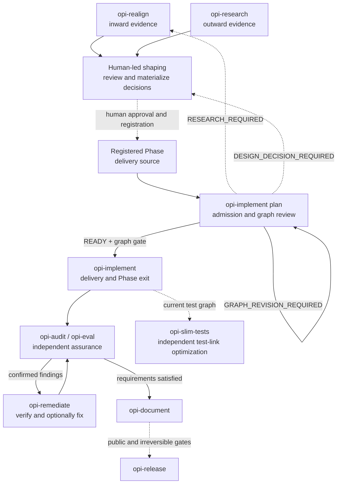

# Opi skills user manual

Opi has ten project skills. Their tracked source lives in `.agents/skills/`;
`.claude/skills` is a compatibility symlink to the same directory. Edit only
the canonical `.agents/skills/` files. Every skill requires explicit user
invocation: for example `$opi-workflow` in Codex or `/opi-workflow` in Claude
Code.

Use `opi-workflow` when the correct entry is unclear. It recommends one next
command and stops; it does not create another workflow ledger.

## Choose an entry in 30 seconds

1. Are you trying to decide **what should be built**?
   - Compare opi with the pinned pi revision: `opi-realign`.
   - Investigate an external capability or ecosystem option: `opi-research`.
   - The evidence exists but the product decision is unsettled: use the
     recommended human-led shaping command; do not start implementation.
2. Is there a reviewed and registered Phase delivery source?
   - No: return to evidence or shaping.
   - Yes: run `opi-implement plan`; run `opi-implement` only after admission.
3. Are you checking or correcting shipped behavior?
   - Static requirement conformance: `opi-audit`.
   - Credentialed real-provider behavior: `opi-eval`.
   - Verify and optionally fix normalized findings: `opi-remediate`.
   - Documentation, release, or test-link cleanup: use the named skill.

## Lifecycle and return loops

Solid arrows are workflow progression. Dashed arrows cross a human decision or
materialization boundary. A `READY` verdict is not implementation or commit
authorization.

## Boundary rules

- Evidence is not a requirement. `opi-realign` and `opi-research` cannot
  authorize product work.
- Shaping is human-led. Tracker maps and candidate specs are non-normative
  until reviewed and materialized into `docs/opi-spec.md` or a registered Phase
  delivery source.
- `opi-implement plan` tests readiness; it does not repair missing product
  meaning. Graph confirmation and Git commit authorization are separate gates.
- `opi-audit` and `opi-eval` diagnose; they do not edit production code. Each
  audit uses the latest committed registered sources and never reads prior
  audit or remediation conclusions.
- `opi-remediate mode=plan` verifies the current active audit and plans;
  `mode=apply` requires explicit approval of that fixed plan's exact digest.
  Apply permits only contract-bounded incidental repairs, and neither mode
  writes the live `.opi-impl-state.json`.
- `opi-document` proves documentation truth; it does not authorize release.
- `opi-release` is the only public publication workflow. Crates.io publication
  has a separate last-moment irreversible gate.

## Skill reference

Effect labels: `RO` reads only, `W` writes repository files, `C` may create a
local commit after an explicit gate, `$` may use credentials or paid providers,
`P` changes public state, and `I` contains an irreversible step.

| Skill | Role and required input | Owned output | Stop/gate and usual next step | Effect |
|---|---|---|---|---|
| `opi-workflow` | Route an uncertain request | One recommended invocation | Stops at every explicit-skill boundary | RO |
| `opi-realign` | Compare an exact pinned pi revision with opi | `docs/realign/*.md` | Evidence only; next is shaping or `opi-implement plan` after registration | W |
| `opi-research` | Investigate outward capabilities from primary sources | `docs/research/*.md` | Evidence only; next is shaping | W |
| `opi-implement` | Admit a registered Phase source, execute its graph, and archive Phase evidence | `.opi-impl-state.json`, Phase snapshots, task changes | Graph, task-commit, ledger-commit, and failure gates are distinct | W, C |
| `opi-audit` | Independently verify one Phase against the latest committed registered sources and implementation | Fixed active set under `docs/snapshots/phase<N>/assurance/`: metadata, requirements, findings, and report | No fixes; current findings go to `opi-remediate` | W |
| `opi-eval` | Run explicit isolated real-provider fidelity cases | `docs/eval/` reports and history | Requires credentials and mutating-tool opt-in where applicable | W, $ |
| `opi-remediate` | With `mode=plan`, verify the current active audit and derive closure batches; with `mode=apply`, execute the exact approved digest | Fixed plan, dispositions, result, and user-approved fixes in the active set | `READY-FOR-APPLY` plus exact-digest approval gates execution; intent changes return to shaping | W |
| `opi-document` | Synchronize truthful English/Chinese docs and source-derived checks | Documentation and doc-check changes | Does not publish | W |
| `opi-release` | Run seven gated release phases for six crates and GitHub assets | Git tag/release and crates.io versions | Public Git gate, then separate irreversible crates gate | W, C, P, I |
| `opi-slim-tests` | Remove duplicate or superseded Rust test binaries without losing behavior | Verified uncommitted test-graph reduction | Never commits automatically | W |

## Assurance model

`opi-audit` and `opi-eval` share the finding vocabulary in
`_shared/references/finding-contract.md`, but only the current active audit's
findings feed `opi-remediate`. One fixed Active Assurance Set lives under the
Phase `assurance/` directory; Git history archives superseded committed sets.
The audit run ID and raw-file digests bind requirements, findings, plan, and
result without historical lineage or consensus inputs. A remediation result can
close a batch and may include only bounded verification-blocking incidental
repairs with their own red/green proof. A later independent audit is admitted
only after fixes and the complete set are committed and the assurance directory
is clean. Generic provider-fidelity canaries are runtime signals; only a
registered runtime-fidelity case can close a product criterion.

Use independent models or reviewers when practical and disclose degraded
independence. No preferred provider or model is part of the project contract.

## Durable artifact ownership

| Artifact | Owner and lifetime |
|---|---|
| `docs/realign/*.md` | `opi-realign`; non-normative inward evidence |
| `docs/research/*.md` | `opi-research`; non-normative outward evidence |
| Tracker maps/tickets and candidate specs | Human-led shaping; non-normative until materialized and registered |
| `docs/opi-spec.md` and registered Phase delivery sources | Human-led shaping; normative sources |
| `.opi-impl-state.json` | `opi-implement`; canonical tracked implementation ledger |
| `.opi-impl-state.draft.json` | `opi-implement plan`; ignored scratch retained only while review/resume needs it |
| `docs/snapshots/phase<N>/` | Frozen implementation ledger snapshots and non-assurance Phase evidence |
| `docs/snapshots/phase<N>/assurance/` | One active audit/remediation set; committed superseded sets remain in Git history |
| `docs/eval/` | `opi-eval` reports and history |
| `.opi-release-state.json` | `opi-release`; ignored resume state retained only during an incomplete release |
| `_shared/references/finding-contract.md` | Shared finding schema |
| `_shared/references/audit-set-contract.md` | Fixed active-set paths, digest binding, rotation, and publication rules |
| `_shared/references/remediation-disposition-contract.md` | Shared current-set verification, decision, incidental-repair, and closure schema |

Only `opi-implement` writes the canonical implementation ledger. Do not create
a second task ledger or record implementation progress in `docs/opi-spec.md`.

## Maintainer composition note

Project-local skills own Opi artifacts and lifecycle boundaries. Matt skills
may supply evidence, domain modeling, design challenge, test-seam design, TDD,
or review lenses when their invocation policy permits it. Superpowers may
supply narrow operational primitives such as evidence-before-completion.
Neither family may replace `.opi-impl-state.json`, silently invoke a
user-only shaping command, or introduce a second plan/execution state machine
inside `opi-implement`.

After selecting a skill, read its `SKILL.md` and only the references it routes
to. Destructive, costly, credentialed, commit-producing, or publication actions
always remain explicit user gates.
