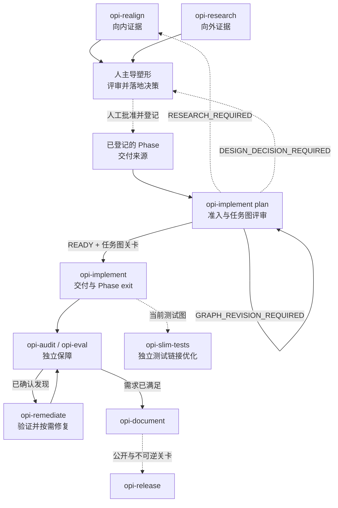

# Opi 技能用户手册

Opi 有十个项目技能。受 Git 跟踪的真实来源位于 `.agents/skills/`；
`.claude/skills` 是指向同一目录的兼容符号链接。只编辑
`.agents/skills/` 下的正式文件。所有技能都必须由用户显式调用，例如 Codex
中的 `$opi-workflow` 或 Claude Code 中的 `/opi-workflow`。

不确定入口时使用 `opi-workflow`。它只推荐一个下一条命令并停止，不会创建
另一套工作流账本。

## 30 秒选择入口

1. 你在决定“应该构建什么”吗？
   - 对照固定的 pi 修订版检查 opi：使用 `opi-realign`。
   - 调研外部能力或生态方案：使用 `opi-research`。
   - 已有证据但产品决策未收敛：使用路由器推荐的人主导塑形命令，不要开始实现。
2. 是否已有评审并登记过的 Phase 交付来源？
   - 没有：返回证据或塑形。
   - 有：先运行 `opi-implement plan`；通过准入后才能运行 `opi-implement`。
3. 你在检查或修正已交付行为吗？
   - 静态需求符合性：`opi-audit`。
   - 带凭据的真实 provider 行为：`opi-eval`。
   - 验证并按需修复统一发现：`opi-remediate`。
   - 文档、发布或测试链接清理：使用对应的具名技能。

## 生命周期与返回循环

实线表示工作流推进；虚线表示必须经过人工决策或将决策落入规范来源。
`READY` 既不代表已经实现，也不代表授权提交。

## 边界规则

- 证据不是需求。`opi-realign` 与 `opi-research` 不能授权产品实现。
- 塑形由人主导。Tracker 地图与候选 spec 在经人工评审并落入
  `docs/opi-spec.md` 或已登记 Phase 交付来源前不具规范性。
- `opi-implement plan` 只检查就绪度，不修补缺失的产品含义。任务图确认与
  Git commit 授权是两个不同关卡。
- `opi-audit` 与 `opi-eval` 只诊断，不编辑生产代码。
- `opi-remediate` 先验证发现再修复，并且永不写入正式
  `.opi-impl-state.json`。
- `opi-document` 证明文档真实，不授权发布。
- `opi-release` 是唯一公开发布流程；crates.io 发布还有独立的最后时刻
  不可逆关卡。

## 技能参考

副作用标记：`RO` 只读，`W` 写仓库文件，`C` 经显式关卡后可能创建本地
commit，`$` 可能使用凭据或付费 provider，`P` 改变公开状态，`I` 包含不可逆步骤。

| 技能 | 角色与必要输入 | 归属产物 | 停止点、关卡与通常下一步 | 副作用 |
|---|---|---|---|---|
| `opi-workflow` | 为不确定请求选择入口 | 一条推荐调用 | 在每个显式技能边界停止 | RO |
| `opi-realign` | 对照固定 pi 修订版检查 opi | `docs/realign/*.md` | 只是证据；经登记后进入塑形或 `opi-implement plan` | W |
| `opi-research` | 基于一手资料调研向外能力 | `docs/research/*.md` | 只是证据；下一步为塑形 | W |
| `opi-implement` | 准入 Phase 来源、执行任务图并归档 Phase 证据 | `.opi-impl-state.json`、Phase 快照、任务变更 | 任务图、任务 commit、账本 commit 和失败关卡相互独立 | W、C |
| `opi-audit` | 按已提交 HEAD 的完整相关实现核实一个 Phase | `docs/snapshots/phase<N>/audit.*.md` | 不修复；已确认发现进入 `opi-remediate` | W |
| `opi-eval` | 运行显式、隔离的真实 provider 保真度用例 | `docs/eval/` 报告与历史 | 可能需要凭据；变更工具还需额外确认 | W、$ |
| `opi-remediate` | 验证 audit/eval 统一发现并按需修正 | `remediation-plan.md`、用户批准的修复 | 执行需要独立用户关卡；意图变化返回塑形 | W |
| `opi-document` | 同步真实中英文文档及源派生检查 | 文档与 doc-check 变更 | 不发布 | W |
| `opi-release` | 为六个 crate 与 GitHub 产物执行七阶段发布 | Git tag/release 与 crates.io 版本 | 公开 Git 关卡之后仍有独立 crates 不可逆关卡 | W、C、P、I |
| `opi-slim-tests` | 在不丢失行为的前提下删除重复或已取代测试二进制 | 已验证、未提交的测试图缩减 | 从不自动提交 | W |

## 保障模型

`opi-audit` 与 `opi-eval` 使用 `_shared/references/finding-contract.md`
输出统一发现。`opi-remediate` 保留原始来源、严重度、独立性和证据，并另行
记录自己的验证。通用 provider-fidelity canary 只是运行时信号；只有登记过的
runtime-fidelity 用例才能关闭产品条件。

条件允许时使用独立模型或评审器，并如实披露独立性降级。项目契约不固定某个
provider 或模型。

## 持久产物归属

| 产物 | 所有者与生命周期 |
|---|---|
| `docs/realign/*.md` | `opi-realign`；非规范向内证据 |
| `docs/research/*.md` | `opi-research`；非规范向外证据 |
| Tracker 地图、票据和候选 spec | 人主导塑形；落入并登记前不具规范性 |
| `docs/opi-spec.md` 与已登记 Phase 交付来源 | 人主导塑形；规范来源 |
| `.opi-impl-state.json` | `opi-implement`；唯一正式、受跟踪实现账本 |
| `.opi-impl-state.draft.json` | `opi-implement plan`；仅在评审/恢复需要时保留的忽略草稿 |
| `docs/snapshots/phase<N>/` | 冻结的实现、审计与修复证据 |
| `docs/eval/` | `opi-eval` 报告与历史 |
| `.opi-release-state.json` | `opi-release`；仅在未完成发布期间保留的忽略恢复状态 |
| `_shared/references/finding-contract.md` | 共享发现格式 |

只有 `opi-implement` 能写正式实现账本。不得创建第二套任务账本，也不得在
`docs/opi-spec.md` 中记录实现进度。

## 维护者组合说明

项目本地技能拥有 Opi 产物和生命周期边界。调用策略允许时，Matt 技能可以
提供证据、领域建模、设计质询、测试 seam 设计、TDD 或评审视角；Superpowers
可以提供“完成前先验证”等窄操作原语。两者都不得替换
`.opi-impl-state.json`、暗中调用仅用户可调用的塑形命令，或在
`opi-implement` 内建立第二套计划/执行状态机。

选定技能后，完整阅读其 `SKILL.md`，并只加载它路由到的 references。破坏性、
付费、使用凭据、产生 commit 或发布的动作始终需要显式用户关卡。
