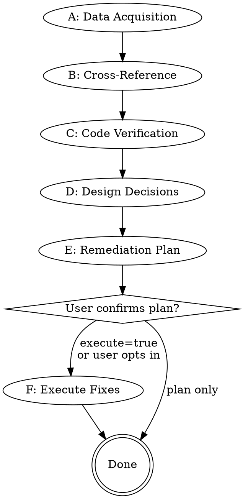

# opi-remediate

Cross-reference, verify, and remediate normalized findings from independent
audit reports and runtime eval reports for a specific opi implementation phase.
The skill validates each finding against actual code or preserved runtime
artifacts, resolves design decisions, and produces a layered remediation plan.
Execution of the plan is optional and user-gated.

## Inputs

```text
phase=<N>          # required; the phase number (e.g. 13)
sources=<path,...> # optional; explicit audit/eval reports; defaults to all phase audit.*.md files
scope=<text>       # optional; focus on specific findings, crates, or themes
execute=<bool>     # optional; continue into execution after plan confirmation
                   # (default: false -- produce plan only)
```

If the user says "remediate phase 13" or "修复 phase 13 审计", extract the
phase number. If no phase number is provided, ask for it.

## Workflow overview



## Phase A: Data acquisition

1. Locate `docs/snapshots/phase<N>/`.

2. Resolve finding sources:
   - when `sources` is present, validate and read exactly those report paths;
   - otherwise discover all phase `audit.*.md` files.
   Accept audit and eval reports containing normalized blocks from
   `../_shared/references/finding-contract.md`. If no source exists, stop and
   ask the user to run `opi-audit` or `opi-eval`.

3. Read `docs/snapshots/phase<N>/opi-impl-state.json`:
   - Extract `spec_files` (or `spec_path` for schema v1).
   - Extract task `verified_at_commit` values as phase-exit provenance; they do
     not define remediation coverage.
   - Extract task graph for context (task IDs, titles, crates, DoDs).

4. Read every selected source report in full. Also read:
   - The design spec(s) referenced by `spec_files`.
   - `AGENTS.md` for project context (`CLAUDE.md` is only its compatibility
     link).
   - `docs/opi-spec.md` for the normative spec.

## Phase B: Cross-reference

When **2+ finding sources** are available, cross-reference their findings. Read
`references/cross-reference-matrix.md` for the full algorithm and trust model.

Summary of the process:

1. **Normalize**: Parse each normalized finding block. Preserve `source_kind`,
   `source_path`, `source_model`, `independence`, `axis`, source severity, and
   source evidence unchanged. Legacy audit narrative may be mapped into the
   contract only with a recorded `degraded-legacy-input` note. Foreign severity
   labels map to the canonical four-tier scale without overwriting the original
   label in the source report.

2. **Cluster**: Group findings that describe the same underlying issue. Use
   file-path overlap and behavioral-theme similarity as clustering signals.
   A single underlying issue may appear with different severity ratings or
   different phrasings across reports.

3. **Record source coverage and independence**:
   - Full independent overlap: every eligible independent source reports it.
   - Partial independent overlap: multiple but not all independent sources.
   - Single independent source: one independent source only.
   - Correlated/degraded overlap: repeated only by same-family or
     unknown-independence sources.

   Count independent source families, not files. Coverage is descriptive; it
   never substitutes for Phase C verification or manufactures a confidence
   score.

4. **Resolve severity conflicts**: When sources assign different severities to
   the same cluster, take the highest as the candidate and record the range.
   Phase C may assign a final severity only with evidence and rationale; it does
   not silently rerank any source finding.

When only one finding source is available, skip clustering and coverage tiers.
Treat every finding as `unverified single-source` and proceed directly to Phase
C with increased scrutiny.

## Phase C: Code verification

Every finding must be verified against the actual codebase before it enters
the remediation plan. Audit reports can contain stale line numbers,
misattributed behavior, or outright misreadings.

### Verification approach

For each finding (or cluster of related findings):

1. Read cited source files in full and inspect cited runtime traces/artifacts.
   Do not rely on search snippets or a report's conclusion.
2. Trace the code path or reproduce the runtime path described in the finding.
3. Classify the finding:
   - **Confirmed**: code matches the audit's description.
   - **Partially confirmed**: the issue exists but the severity or scope
     differs from the audit's claim.
   - **Cannot confirm**: the cited code does not exhibit the described
     behavior, but the issue may exist elsewhere.
   - **Refuted**: the audit's claim is demonstrably incorrect.

### Parallel verification (recommended)

When the finding set is large (10+ findings), split verification work by
crate or code-path group and use parallel subagents. Each subagent receives
a subset of findings and the relevant source files. The parent collects
results and reconciles.

If subagents are unavailable, verify sequentially -- correctness is more
important than speed.

### Verification output

Produce a verification summary listing every finding with its verification
status. Refuted findings are dropped from the remediation plan with a
recorded reason. "Cannot confirm" findings are flagged for manual review.

## Phase D: Design decisions

For each confirmed finding, determine the fix direction:

### Auto-decision criteria

Apply an automatic decision (with recorded rationale) when:
- The existing normative criterion and verified production seam determine one
  behavior-preserving correction (for example truthful doc wording or a missing
  regression test for already-required behavior).
- The change does not choose new product semantics, public API, compatibility,
  architecture, or core-vs-plugin placement.

Source agreement is evidence, not design authority. Multiple reviewers
recommending the same new architecture does not make it an automatic decision.

### Escalation criteria

Ask the user when:
- Multiple architecturally different approaches exist (e.g., "render
  BranchSummary to provider now" vs "explicitly defer to next phase").
- The fix has backward-compatibility implications for embedders.
- The fix requires removing functionality or changing public API.
- Finding sources disagree on the correct fix direction.
- The finding exposes a missing requirement or changes product intent; route
  it back to shaping instead of deciding inside remediation.

When escalating, present:
- The options (labeled a/b/c...).
- A recommended option with rationale.
- The source reports' positions on each option.

### Decision record

Every decision (auto or user) is recorded in the remediation plan with:
- The finding ID(s) it addresses.
- The chosen approach.
- The rationale.

## Phase E: Remediation plan

Read `references/remediation-plan-template.md` for the output format.

### Layer derivation

Fixes are organized into layers based on the workspace dependency graph:

1. Run `cargo metadata --no-deps --format-version 1`; if unavailable, derive
   the graph from the root and crate `Cargo.toml` manifests, which own the
   current workspace topology.
2. Crates with no internal dependencies are Layer 1 (substrate).
3. Crates that depend on Layer 1 crates are Layer 2.
4. Continue until all crates are assigned.
5. Documentation fixes are always the final layer.

Within each layer, order fixes by:
1. Code changes that other fixes depend on (e.g., a new public API that
   other crates will call).
2. Code changes without dependencies.
3. Test additions.

### Plan content

For each fix item:
- Finding source(s), source kind(s), and finding ID(s).
- Verification status (confirmed / partially confirmed).
- File path(s) and approximate line numbers.
- Description of the change.
- Associated test plan (new test, modified test, or existing test covers it).

### Verification commands

The normalized findings and derived layers define remediation scope. Use the
[shared change-scope reference](../_shared/references/change-scope-and-check-selection.md)
only after edits to inventory the actual changed surfaces and compute the
verification union; it neither adds findings nor removes source-mandated
coverage.

Derive verification from the affected task/crate tier. A single-crate layer
uses the scoped smoke mode and named affected integration tests. Reserve the
full workspace mode for cross-crate/workspace changes. Documentation layers run
`python scripts/opi-doc-check.py` and any source-specific EN/ZH checks. Do not
compile every workspace test binary merely because the source finding came from
a phase audit.

### Output

Write the plan to `docs/snapshots/phase<N>/remediation-plan.md`.
Present a summary to the user and ask for confirmation before proceeding.

## Phase F: Execute fixes (optional)

Entered only when `execute=true` or the user opts in after reviewing the plan.
Read `references/execution-protocol.md` for the full protocol.

Summary:

1. Work through layers in dependency order.
2. Within each layer, apply code changes, then test additions.
3. After each layer, run the layer's verification commands.
4. If verification fails, stop and report. Do not proceed to the next layer
   with a broken previous layer.
5. After all layers pass, run the union of affected tier gates; run
   workspace-wide smoke only when the remediation is cross-crate/workspace
   scoped.
6. Report final status.

## Guardrails

- Do not modify `.opi-impl-state.json` -- that file belongs to `opi-implement`.
- Do not commit or push unless the user explicitly asks.
- Do not modify design spec files unless an audit finding specifically
  identifies a spec documentation error and the user approves returning that
  decision to the source-owning shaping flow.
- Every changed line must trace to a verified audit finding. Do not refactor,
  reformat, or improve code outside the finding scope.
- Do not add features. Remediation fixes defects, inconsistencies, and gaps
  identified by audits.
- When updating documentation with a localized counterpart (e.g., `.zh.md`),
  update both in the same change.
- Follow the project's git rules: never `git add -A`, never `git add .`,
  only stage specific files you modified.

## Relationship to other skills

```text
opi-audit  -->  produces audit reports (docs/snapshots/phase<N>/audit.*.md)
                    |
opi-eval   -->  produces runtime reports (docs/eval/*.md)
                    |
opi-remediate  -->  consumes normalized findings, produces remediation-plan.md,
                    optionally executes fixes
                    |
opi-implement  -->  drives next-phase implementation (independent ledger)
```

`opi-remediate` may read the frozen Phase snapshot ledger as historical
requirements and provenance. It never reads as authority from, or writes, the
live canonical `.opi-impl-state.json`; `opi-implement` alone owns that state.

## References

- Read `references/cross-reference-matrix.md` for clustering, source coverage,
  independence handling, and severity mapping.
- Read `references/remediation-plan-template.md` for the plan output format
  and required fields.
- Read `references/execution-protocol.md` for the layer-by-layer execution
  protocol, verification gates, and failure handling.
- Read `../_shared/references/finding-contract.md` before acquiring findings.
