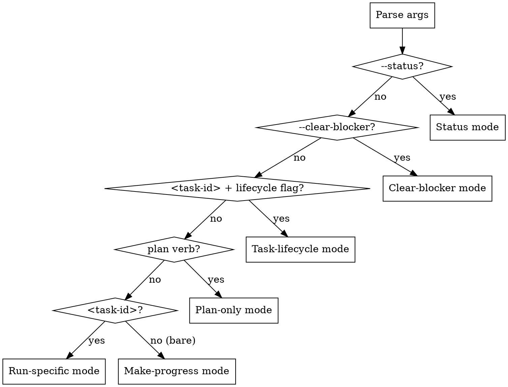
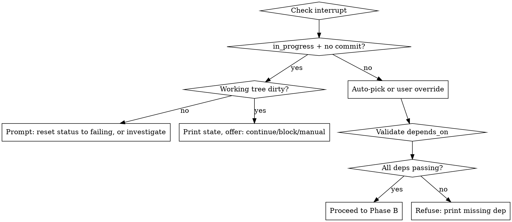

# opi-implement

Long-running-agent harness that drives `docs/opi-spec.md` implementation, plus
reviewed supplemental Phase 14-16 product-hardening specs listed in this skill,
one task at a time with TDD for code tasks, documentation guard verification
for docs-only tasks, tiered verification, and JSON-ledger checkpointing.

This is a **harness**, not a coding assistant. It encodes opinions about state,
evidence, failure recovery, and escalation. It does NOT edit `opi-spec.md`,
push commits, publish crates, or make network calls to providers.

**Spec alignment rule:** Before executing any task whose `phase >= current_phase`,
compare each entry in the ledger `spec_files_sha256` map with the current hash
of the corresponding file in `spec_files`. If any entry differs, auto-enter the
plan path's drift branch (Reinit Reconciliation + `A.init.2e/2f` verify-and-fold
+ the `A.init.3` gate) per `references/initializer.md` and spec §5.3; do not
auto-pick or run a task until the human confirms the reconciled graph. Only
`--status` bypasses drift handling. Phase 1/2 retries that fall below
`current_phase` are allowed because their `Opi-DoD-SHA256` commit footers are
the authoritative contract for shipped work. Do not run stale ledger tasks whose
title or DoD contradicts the current spec.

**Reviewed supplemental sources:** Supplemental tasks come only from this
registry. Do not auto-parse arbitrary files from `docs/superpowers/specs/`.

| Phase | Source files |
|---:|---|
| 14 | `docs/superpowers/specs/2026-07-11-phase14-provider-auth-design.md` |
| 14 | `docs/superpowers/specs/2026-07-14-phase14-exit-remediation-design.md` |
| 15 | `docs/superpowers/specs/2026-07-11-phase15-safety-sandbox-design.md` |
| 16 | `docs/superpowers/specs/2026-07-11-phase16-agent-intelligence-design.md` |

When a ledger is initialized or reconciled for a supplemental phase, the
phase's registered source files MUST be included in `spec_files` and hashed in
`spec_files_sha256` alongside `docs/opi-spec.md`. Phases 14-16 derive draft
task rows from the registered design's goals, per-ticket design sections,
sequencing, and residuals, then require task-graph review before execution.

**Product-loop integrity rule:** A phase is not complete merely because every
component task is green. When a source spec contains goals, success criteria,
exit criteria, or user workflows, init/reinit MUST map them into executable
`acceptance_scenarios`. Every scenario needs an owning task, verification
command/test, and production call-site trace when it claims runtime behavior.
If a task proves only a helper, parser, protocol type, or bridge object without
showing that production startup/CLI/runtime calls it, mark it as substrate
coverage only; do not let it close a product acceptance scenario.

**DoD precision rule:** Vague verbs in a DoD (`works`, `supports`, `loads`,
`integrates`, `bridges`, `productizes`, `handles`) MUST be expanded during
init/reinit or task-graph review into concrete observable assertions:
command/API entry point, persisted artifact, production call site, runtime
effect, diagnostics, and negative/error behavior where relevant. A vague DoD is
not executable until expanded or explicitly accepted as a substrate-only task.

## Invocation

```text
opi-implement                                  # make-progress: sync-if-needed -> auto-pick -> run (no-drift); plan+pause (drift)
opi-implement plan                             # sync-only plan path (init or drift-reconcile), don't run
opi-implement <task-id>                        # specific task (sync-if-needed first; validates deps)
opi-implement --status                         # print ledger summary
opi-implement <task-id> --resume-from-manual   # verify a manual commit
opi-implement <task-id> --extend-cap <N>       # raise iteration cap
opi-implement --clear-blocker <id> --because <text>  # unblock a task
```

## Mode Detection

Dispatch order (first match wins): `--status` → status mode; `--clear-blocker`
→ clear-blocker mode; `<task-id>` with `--resume-from-manual` / `--extend-cap`
→ task-lifecycle mode; `plan` verb → plan-only mode (sync, then stop at the
`A.init.3` gate); `<task-id>` → run-specific mode (sync-if-needed first);
bare → make-progress mode (sync-if-needed → auto-pick → run). Only `--status`
bypasses drift handling.



**Drift rule (spec §5.3):** make-progress and run-specific both sync-if-needed
first. On no drift, they proceed (make-progress auto-picks and runs;
run-specific runs the named task). On drift, both run Reinit Reconciliation +
`A.init.2e/2f` verify-and-fold, then PRESENT the `A.init.3` gate and PAUSE —
neither auto-picks nor runs a task until the human confirms the reconciled
graph. Bare `opi-implement` thus degrades to plan+pause when drift is detected.

**Auto-pick rule:** Lowest task ID (lexicographic, numerically aware) whose
`status` is `failing` AND every `depends_on` entry is `passing`. A dependency
is satisfied if it appears as `passing` in the active `tasks` array OR in any
`phase_exit[*].task_summary` entry. Tasks with `status: blocked` are skipped
until `--clear-blocker`.

Root `phase_exit[*].task_summary` entries are the durable dependency/status
index. Do not replace them with snapshot pointers unless the dependency
resolver is changed to load phase archives on demand.
Keep root `phase_exit[*]` compact: store short exit metadata, `snapshot_path`,
and `task_summary` there. Put long evaluator traces, expanded evidence tables,
and audit narratives in the phase-local snapshot or sibling audit markdown.

**User-override rule:** Refuse if any `depends_on` is not satisfied by the
active tasks or archived phase summaries; print which dep is missing.

## Six Phases Per Invocation

Phases A, B, F are cheap and always execute. C and D are the work body.
E is the only phase that mutates git **during normal task execution**.
(The plan path also commits tracked harness files - see `references/initializer.md`.)

1. **Phase A: Bootstrap**
   - A.1 Detect mode (status / clear-blocker / task-lifecycle / plan / run-specific / make-progress)
   - A.2 Load or create `.opi-impl-state.json`
   - A.3 Session ritual: `pwd`, `git status`, `git log -5 --oneline`, smoke
   - A.4 Select target task (auto-pick or validate override)

2. **Phase B: Plan-the-task**
   - B.1 Print task DoD + verification tier + parallelize plan + owned
     acceptance scenarios + required production call-site traces + phase
     source files + phase-specific forbidden-scope guards
   - B.2 User gate: "proceed with task `<id>` and create the task commit plus
     its separate ledger-checkpoint commit if verification passes?"
   - B.3 If confirmed: mark `in_progress`, record `start_commit`, write ledger

3. **Phase C: Implement**
   - C.1 Invoke `superpowers:test-driven-development` (red-green-refactor)
     - If `parallelize` non-empty -> `superpowers:dispatching-parallel-agents`
   - C.1a If implementation requires modifying files outside
     `tasks[].task_owned_paths`, the harness MUST append the new glob to
     `task_owned_paths` and record an `inference_notes` entry
     (`field = "task_owned_paths"`, `reason = "<why>"`) via the atomic ledger
     write BEFORE the file is edited. Append is the only Phase C mutation of a
     const field; it never silently expands ownership.
   - C.2 Iteration cap 3 -> invoke `superpowers:systematic-debugging`
   - C.3 Total cap 5 -> failure decision gate

4. **Phase D: Verify**
   - D.0 Product acceptance checks:
     - Run every `acceptance_scenarios` verification owned by the task.
     - For runtime/startup/CLI claims, prove the production call site exists and
       is exercised by the scenario. A direct helper/unit test is not enough.
     - If the scenario cannot be exercised yet, the task may pass only as
       substrate coverage and must leave the scenario open on a later vertical
       slice task.
   - D.0a Artifact truthfulness gate:
     - If a task claims runtime, CLI, JSON/NDJSON, RPC, session, provider, tool,
       browser, or generated-artifact behavior, read
       `references/artifact-truthfulness.md` before verification.
     - Preserve command, stdout, stderr, exit code, session/NDJSON artifacts,
       and provider/browser captures needed by the claim.
     - Run `scripts/opi-artifact-audit.py` or its platform wrapper when an
       artifact directory exists.
     - Classify each claim as `verified`, `observed-unpreserved`,
       `source-inferred`, or `not-opi`; only `verified` closes runtime
       acceptance criteria.
   - D.1 Tier-specific mechanical gates and phase-specific addenda
   - D.2 Task-level risk evaluator: for `evaluator_required = true` tasks it
     invokes `.claude/skills/opi-implement/scripts/exec.workflow.js` (full 6-lens deep); for all others the
     2-lens single-agent L-D1+L-D5 pass per `references/verify-engine.md`.
     Must-fix findings block Phase D and route to Phase C (incrementing
     `iteration_count`).
   - D.3 Cross-cutting gates: fmt, clippy, doc, smoke
   - D.4 If any fail -> back to Phase C

5. **Phase E: Task Commit & Ledger Checkpoint**
   - E.1 Commit only task-owned implementation files with `Opi-*` evidence
     footers; never stage the dirty canonical ledger in this commit
   - E.2 Capture the task commit SHA + evidence, flip status to `passing`, and
     append the session note through the atomic ledger protocol
   - E.3 Validate and commit only `.opi-impl-state.json` with message
     `chore(opi-implement): checkpoint task <id> ledger`
   - E.4 No push (push is separate human action)

6. **Phase F: Phase-Exit Check**
   - F.1 If all phase tasks passing -> run phase-exit evaluator
   - F.1a Phase-exit evaluator MUST rebuild the source spec's success/exit
     criteria, goals, non-goals, and named workflows from the current spec
     files, inspect code/tests independently of ledger claims, and produce a
     criteria trace with one of:
     `met`, `deferred-by-updated-design`, or `not-met`. It then invokes
     `.claude/skills/opi-implement/scripts/phase-exit.workflow.js` (5-lens audit of the trace per
     `references/verify-engine.md`); accepted findings upsert
     `criteria_trace[C].status = not-met`, and F.1b REFUSEs archive.
   - F.1b REFUSE phase archive when any criterion is `not-met`, or when
     `deferred-by-updated-design` lacks an exact source citation from the
     current spec/plan.
   - F.2 Print phase-complete report; no auto-release
   - F.3 Else -> print "next unblocked: X.Y" hint
   - F.4 If F.1 passed, run the archive gate:
     - F.4a User gate: "Archive phase `<N>` ledger to
       `docs/snapshots/phase<N>/opi-impl-state.json` as a phase-local snapshot
       and compact `tasks` array into `phase_exit[<N>].task_summary`?"
     - F.4b If confirmed: write a phase-local snapshot containing the top-level
       schema/spec metadata, only the completed tasks for phase `<N>`, and only
       `phase_exit[<N>]` (including any detailed `criteria_trace`; do not copy
       prior phases' `phase_exit` records into the snapshot). Then mutate the
       root ledger via atomic protocol: move completed tasks into
       `phase_exit[<N>].task_summary`, set `phase_exit[<N>].snapshot_path`,
       keep only compact phase-exit metadata in the root entry, and remove
       those tasks from the active `tasks` array. Commit ONLY the new snapshot
       and canonical ledger with message
       `chore: archive opi-implement phase <N> ledger snapshot`.
     - F.4c If declined: leave tasks array intact; no snapshot written.

**When the plan path runs (init or drift-reconcile):** Read `references/initializer.md` for the full flow.

**When A.init.2e/2f (verify-and-fold) runs:** Read `references/verify-engine.md`
for the six plan-stage lens charters, the shared harness, the auto-deep
classifier, and the exec/phase-exit stage protocols.

**When Phase D runs:** Read `references/verification-tiers.md` for gate details.

**When iteration cap hits:** Read `references/failure-gate.md` for the protocol.

## Task Selection



## Composition With Sub-Skills

| Phase | Skill | Purpose |
|---|---|---|
| C.1 | `superpowers:test-driven-development` | red-green-refactor body |
| C.1 | `superpowers:dispatching-parallel-agents` | when `parallelize` non-empty |
| C.2 | `superpowers:systematic-debugging` | attempt 3+ can't reach green |
| D.2 | verify engine exec stage (`.claude/skills/opi-implement/scripts/exec.workflow.js` deep, or single-agent L-D1+L-D5) | adversarial must-fix verify for risk-gated tasks |
| D pre-commit | `superpowers:verification-before-completion` | evidence-before-claim |
| Failure (b) | `superpowers:brainstorming` | DoD interpretation ambiguous |

Each invocation announces itself:
`"Using superpowers:test-driven-development to drive red-green for task 1.6"`

## Parallel Sub-Unit Contract

When `parallelize` is non-empty:
- Sub-agents work on disjoint files; MUST NOT create commits
- Parent applies results in ledger order, runs full verification after each merge
- Completion events may arrive out of order; persisted evidence uses `parallelize` array order
- Conflict or overlapping edit -> fail attempt -> normal debug/failure path

## Commit Evidence Format

Every successful task commit MUST include these parseable footers:

```text
Opi-Task: <id>
Opi-DoD-SHA256: <sha256 of definition_of_done>
Opi-Verification: <tier>; <short command/result summary>
Opi-Evaluator: <not-required | passed>
```

If the task owns any `acceptance_scenarios`, also include:

```text
Opi-Acceptance: <scenario ids>; <command/test/call-site evidence summary>
```

Commit type is derived from the ledger `commit_type` field (feat/fix/docs/etc).
Commit scope is the crate name. Example: `feat(opi-agent): implement agent_loop`

## Ledger Location & Safety

- Path: `.opi-impl-state.json` (tracked canonical ledger)
- Temp: `.opi-impl-state.json.tmp` (gitignored)
- Draft: `.opi-impl-state.draft.json` (gitignored)
- Candidates, backups, and corrupt copies are gitignored and NEVER committed
- All writes use structured JSON APIs, never string concatenation
- On Windows, validate every candidate and perform every replacement through
  `.claude/skills/opi-implement/scripts/ledger-guard.ps1`. Pass the SHA-256
  observed before mutation as `-ExpectedTargetSha256`; a mismatch means another
  writer changed the ledger, so stop and re-read instead of overwriting it.
  Encoding-recovery operations also pass `-BackupPath` so the atomic replacement
  retains the corrupt source for audit instead of deleting it.
- The guard requires strict BOM-less UTF-8, valid schema-v2 JSON, a maximum
  16 MiB ledger, a maximum 65,536 characters per string, no known repeated
  UTF-8/GB2312 mojibake markers, and no sensitive property names, bearer
  credentials, or private-key material. Put larger or sensitive narratives in
  redacted audit artifacts and keep only paths and short summaries in the
  ledger.
- Windows PowerShell 5.1 MUST NOT round-trip ledger text through default
  `Get-Content`, `Set-Content`, `Out-File`, or PowerShell `>` redirection. Its
  default text encoding follows the system ANSI code page and can corrupt
  BOM-less UTF-8. If a candidate is created outside the guard, use a structured
  writer with explicit strict UTF-8 and let the guard validate it before install.
- Shared-workspace rule: capture the pre-task baseline dirty file set at Phase B.
  Verification and commit gates must stage only task-owned files and must not
  require unrelated pre-existing user changes to be cleaned.
- Phase B and failed attempts may leave the tracked ledger dirty. Successful
  tasks checkpoint it after the task commit; blocked handoffs, phase-exit
  updates, and reviewed graph reconciliation checkpoint it at the durable
  boundary.
- Before removing a worktree, refuse cleanup if its canonical ledger is dirty,
  staged, or untracked; if a ledger temp remains; or if a required checkpoint
  commit is not contained in the destination branch.
- Resolve ledger merge conflicts by rebuilding through plan-path
  reconciliation from destination state and both branches' `Opi-*` evidence.
  Never choose one side wholesale.
- **When ledger manipulation needed:** Read `references/ledger-schema.md`

## Platform Detection

- Detect host via `OSTYPE`/`OS` env vars and shell type
- Linux/macOS: run `scripts/opi-impl-smoke.sh`
- Windows native PowerShell: run `scripts/opi-impl-smoke.ps1`
- Windows bash (Git Bash/MSYS/WSL): run `scripts/opi-impl-smoke.sh` with
  forward-slash paths
- SHA-256: use `sha256sum`, PowerShell `Get-FileHash`, Python, or Rust helper
- JSON manipulation: `jq` when present; fallback to PowerShell/Python
- Windows ledger validation/install:
  `.claude/skills/opi-implement/scripts/ledger-guard.ps1`
- Required: `cargo` (Rust >= 1.97), `git`
- NOT required: `gh` CLI (belongs to `opi-release`)

## Red Flags - STOP Immediately

These are the top violations this harness prevents. Full table with reasoning
in `references/anti-patterns.md`.

1. **Never delete or weaken tests to make them pass.** Fix the implementation.
2. **Never bypass clippy with crate-wide `#[allow]`.** Per-item with comment OK.
3. **Never self-grade verification.** Gates are mechanical (exit codes, grep).
4. **Never auto-accept TUI snapshot changes.** Require explicit user approval.
5. **Never clean/restore/discard user changes from failure gate.** Print
   candidate commands; let the human decide.
6. **Never satisfy DoD with stubs/TODOs.** Unless DoD explicitly says scaffolding.
7. **Never silently rewrite task graph metadata.** Graph is a reviewed contract.
8. **Never commit transient ledger files.** The canonical ledger requires a
   dedicated checkpoint; tmp, draft, candidate, backup, and corrupt files
   remain untracked.
9. **Never skip `[workspace.dependencies]` for internal deps.** Lockstep versioning.
10. **Never run live provider tests.** They belong in `#[ignore]`-gated tests.
11. **Never close a product scenario with component-only tests.** Helper,
    parser, protocol, and bridge tests are substrate evidence until an
    end-to-end production path exercises them.
12. **Never mark an unused runtime integration as passing.** If a function such
    as startup registration, resolver loading, or state persistence has no
    production call site, the task remains open or substrate-only.
13. **Never archive a phase from ledger status alone.** Phase exit must trace
    current source-spec criteria to code and tests independently.
14. **Never let vague DoD verbs stand.** Expand them before execution or stop
    for task-graph review.
15. **Never implement a phase non-goal to satisfy an adjacent criterion.**
    If a criterion appears to require npm, marketplace, OAuth, telemetry,
    sandboxing, web-ui parity, pi session compatibility, or workflow tools in
    core, stop for graph review instead.
16. **Never add unregistered supplemental docs to `spec_files`.** Only the
    reviewed source registry in this skill can make design/plan files
    normative for ledger drift checks.

The skill refuses to act if any rule would be violated, even if the user
requests it during a failure-decision gate.

## Status Mode (`--status`)

Print a summary table of all tasks:
- id, title, status, tier, depends_on (with pass/fail indicators)
- Current phase number
- Current `spec_files` and any hash drift warning
- Next unblocked task hint
- Any blocked tasks with blocker text
- Phase-exit status for completed phases

## Clear-Blocker Mode (`--clear-blocker <id> --because <text>`)

1. Validate task exists and `status = blocked`
2. Append `--because` text to `session_notes`
3. Clear `blocker` field
4. Set `status = failing`
5. Write ledger
6. Print confirmation + next-task hint

## Scope Boundaries (Never Cross)

- Editing `docs/opi-spec.md` except for a reviewed documentation/alignment task
  whose DoD explicitly owns `docs/opi-spec.md` and its localized counterpart
- Pushing commits or tags to `origin`
- Publishing to crates.io
- Building cross-platform binaries
- Network calls to any provider API
- Opening GitHub issues, PRs, or releases
- Reading/writing user runtime data such as `~/.config/opi/`, real auth files,
  or real session storage. Editing source code for config/session behavior is
  allowed only when the selected spec task owns that behavior.

## Design Spec

Full design rationale: `docs/superpowers/specs/2026-05-20-opi-implement-skill-design.md`

Supplemental Phase 14-16 designs:
- `docs/superpowers/specs/2026-07-11-phase14-provider-auth-design.md`
- `docs/superpowers/specs/2026-07-14-phase14-exit-remediation-design.md`
- `docs/superpowers/specs/2026-07-11-phase15-safety-sandbox-design.md`
- `docs/superpowers/specs/2026-07-11-phase16-agent-intelligence-design.md`
