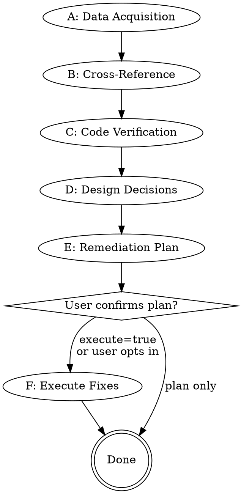

# opi-remediate

Cross-reference, verify, and remediate findings from independent audit reports
for a specific opi implementation phase. The skill consumes audit reports
produced by `opi-audit`, validates each finding against actual code, resolves
design decisions, and produces a layered remediation plan. Execution of the
plan is optional and user-gated.

## Inputs

```text
phase=<N>          # required; the phase number (e.g. 13)
scope=<text>       # optional; focus on specific findings, crates, or themes
execute=<bool>     # optional; continue into execution after plan confirmation
                   # (default: false -- produce plan only)
```

If the user says "remediate phase 13" or "修复 phase 13 审计", extract the
phase number. If no phase number is provided, ask for it.

## Workflow overview



## Phase A: Data acquisition

1. Locate `docs/snapshots/phase<N>/`.

2. Discover all `audit.*.md` files. Record their auditor identifiers (the
   part after `audit.` and before `.md`, e.g. `codex`, `glm5.2`, `opus4.6`).
   If zero audit files exist, stop and tell the user to run `opi-audit` first.

3. Read `docs/snapshots/phase<N>/opi-impl-state.json`:
   - Extract `spec_files` (or `spec_path` for schema v1).
   - Extract the commit range from task `verified_at_commit` values.
   - Extract task graph for context (task IDs, titles, crates, DoDs).

4. Read all audit files in full. Also read:
   - The design spec(s) referenced by `spec_files`.
   - `CLAUDE.md` / `AGENTS.md` for project context.
   - `docs/opi-spec.md` for the normative spec.

## Phase B: Cross-reference

When **2+ audit reports** are available, cross-reference their findings. Read
`references/cross-reference-matrix.md` for the full algorithm and trust model.

Summary of the process:

1. **Normalize**: Extract each report's findings into a flat list with
   uniform fields: `id`, `severity`, `file(s)`, `theme`, `description`.
   Different reports use different severity scales -- map them to a unified
   four-tier scale (Blocker / Major / Minor / Info).

2. **Cluster**: Group findings that describe the same underlying issue. Use
   file-path overlap and behavioral-theme similarity as clustering signals.
   A single underlying issue may appear with different severity ratings or
   different phrasings across reports.

3. **Tier by consensus**:
   - **Full consensus** (all auditors agree): highest confidence.
   - **Majority consensus** (>50% of auditors): high confidence.
   - **Unique finding** (single auditor): needs extra verification scrutiny.

4. **Resolve severity conflicts**: When auditors assign different severities
   to the same finding, take the highest severity as the candidate and record
   the range. The verification step (Phase C) may adjust.

When **only 1 audit report** is available, skip clustering and consensus
tiers. Treat every finding as "unverified single-source" and proceed directly
to Phase C with increased scrutiny.

## Phase C: Code verification

Every finding must be verified against the actual codebase before it enters
the remediation plan. Audit reports can contain stale line numbers,
misattributed behavior, or outright misreadings.

### Verification approach

For each finding (or cluster of related findings):

1. Read the cited source file(s) in full. Do not rely on search snippets.
2. Trace the code path described in the finding.
3. Classify the finding:
   - **Confirmed**: code matches the audit's description.
   - **Partially confirmed**: the issue exists but the severity or scope
     differs from the audit's claim.
   - **Cannot confirm**: the cited code does not exhibit the described
     behavior, but the issue may exist elsewhere.
   - **Refuted**: the audit's claim is demonstrably incorrect.

### Parallel verification (recommended)

When the finding set is large (10+ findings), split verification work by
crate or code-path group and use parallel subagents. Each subagent receives
a subset of findings and the relevant source files. The parent collects
results and reconciles.

If subagents are unavailable, verify sequentially -- correctness is more
important than speed.

### Verification output

Produce a verification summary listing every finding with its verification
status. Refuted findings are dropped from the remediation plan with a
recorded reason. "Cannot confirm" findings are flagged for manual review.

## Phase D: Design decisions

For each confirmed finding, determine the fix direction:

### Auto-decision criteria

Apply an automatic decision (with recorded rationale) when:
- Only one reasonable fix exists (e.g., doc wording correction, alignment
  matrix status update, missing redaction call).
- The audit reports converge on the same recommendation.
- The fix is purely additive (new test, new diagnostic field).

### Escalation criteria

Ask the user when:
- Multiple architecturally different approaches exist (e.g., "render
  BranchSummary to provider now" vs "explicitly defer to next phase").
- The fix has backward-compatibility implications for embedders.
- The fix requires removing functionality or changing public API.
- Auditors disagree on the correct fix direction.

When escalating, present:
- The options (labeled a/b/c...).
- A recommended option with rationale.
- The auditors' positions on each option.

### Decision record

Every decision (auto or user) is recorded in the remediation plan with:
- The finding ID(s) it addresses.
- The chosen approach.
- The rationale.

## Phase E: Remediation plan

Read `references/remediation-plan-template.md` for the output format.

### Layer derivation

Fixes are organized into layers based on the workspace dependency graph:

1. Run `cargo metadata --no-deps --format-version 1` (or read the root
   `Cargo.toml` workspace layout from `CLAUDE.md`) to determine crate
   dependencies.
2. Crates with no internal dependencies are Layer 1 (substrate).
3. Crates that depend on Layer 1 crates are Layer 2.
4. Continue until all crates are assigned.
5. Documentation fixes are always the final layer.

Within each layer, order fixes by:
1. Code changes that other fixes depend on (e.g., a new public API that
   other crates will call).
2. Code changes without dependencies.
3. Test additions.

### Plan content

For each fix item:
- Audit source(s) and finding ID(s).
- Verification status (confirmed / partially confirmed).
- File path(s) and approximate line numbers.
- Description of the change.
- Associated test plan (new test, modified test, or existing test covers it).

### Verification commands

Each layer includes:
```
cargo fmt --all
cargo clippy -p <crate> --all-targets -- -D warnings
cargo test -p <crate> --all-targets
```

Final verification after all layers:
```
cargo test --workspace --all-targets
cargo test --workspace --doc
```

### Output

Write the plan to `docs/snapshots/phase<N>/remediation-plan.md`.
Present a summary to the user and ask for confirmation before proceeding.

## Phase F: Execute fixes (optional)

Entered only when `execute=true` or the user opts in after reviewing the plan.
Read `references/execution-protocol.md` for the full protocol.

Summary:

1. Work through layers in dependency order.
2. Within each layer, apply code changes, then test additions.
3. After each layer, run the layer's verification commands.
4. If verification fails, stop and report. Do not proceed to the next layer
   with a broken previous layer.
5. After all layers pass, run the workspace-wide smoke check.
6. Report final status.

## Guardrails

- Do not modify `.opi-impl-state.json` -- that file belongs to `opi-implement`.
- Do not commit or push unless the user explicitly asks.
- Do not modify design spec files unless an audit finding specifically
  identifies a spec documentation error (e.g., "spec says X but code does Y
  and Y is correct").
- Every changed line must trace to a verified audit finding. Do not refactor,
  reformat, or improve code outside the finding scope.
- Do not add features. Remediation fixes defects, inconsistencies, and gaps
  identified by audits.
- When updating documentation with a localized counterpart (e.g., `.zh.md`),
  update both in the same change.
- Follow the project's git rules: never `git add -A`, never `git add .`,
  only stage specific files you modified.

## Relationship to other skills

```text
opi-audit  -->  produces audit reports (docs/snapshots/phase<N>/audit.*.md)
                    |
opi-remediate  -->  consumes audit reports, produces remediation-plan.md,
                    optionally executes fixes
                    |
opi-implement  -->  drives next-phase implementation (independent ledger)
```

`opi-remediate` never reads or writes the `opi-implement` ledger. The two
skills operate on different lifecycle stages: `opi-implement` builds new
phases forward; `opi-remediate` fixes backward from audit findings.

## References

- Read `references/cross-reference-matrix.md` for the cross-reference
  algorithm, consensus tiers, severity mapping, and trust model.
- Read `references/remediation-plan-template.md` for the plan output format
  and required fields.
- Read `references/execution-protocol.md` for the layer-by-layer execution
  protocol, verification gates, and failure handling.
